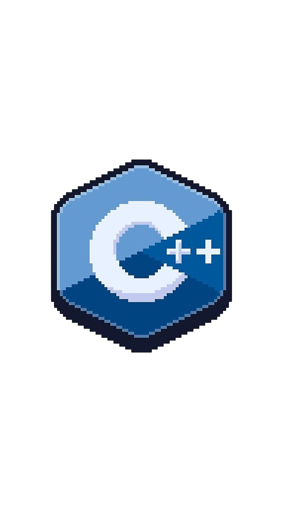

</img>

<!-- ================= TERMINAL + RIGHT IMAGE SECTION ================= -->
<p align="center">
  <a href="https://github.com/DenverCoder1/readme-typing-svg">
    
  </a>
</p>

<table width="100%">
<tr>
<td width="55%" valign="top">

```bash
> Shubham-Singh — ㅤㅤㅤㅤㅤㅤ ㅤㅤㅤㅤㅤㅤㅤㅤㅤㅤ ㅤㅤㅤㅤㅤㅤㅤㅤㅤㅤ ㅤㅤㅤㅤㅤㅤㅤㅤㅤㅤ ㅤㅤㅤㅤㅤㅤㅤㅤㅤㅤ ㅤㅤㅤㅤㅤㅤㅤㅤㅤㅤ ㅤㅤㅤㅤㅤㅤㅤㅤㅤㅤ ㅤㅤㅤㅤㅤㅤㅤㅤㅤㅤ ㅤㅤㅤㅤㅤㅤㅤㅤㅤㅤ ㅤㅤㅤㅤㅤㅤㅤㅤㅤㅤ ㅤㅤㅤㅤㅤㅤㅤㅤㅤㅤ ㅤㅤㅤㅤㅤㅤㅤㅤㅤㅤ ㅤㅤㅤㅤㅤㅤㅤㅤㅤㅤ ㅤㅤㅤㅤㅤㅤㅤㅤㅤㅤ ㅤㅤㅤㅤㅤㅤ ㅤㅤㅤㅤㅤㅤㅤㅤㅤㅤ ㅤㅤㅤㅤㅤㅤㅤㅤㅤㅤ ㅤㅤㅤㅤㅤㅤㅤㅤㅤㅤ ㅤㅤㅤㅤㅤㅤㅤㅤㅤㅤ ㅤㅤㅤㅤㅤㅤㅤㅤㅤㅤ ㅤㅤㅤㅤㅤㅤㅤㅤㅤㅤ ㅤㅤㅤㅤㅤㅤㅤㅤㅤㅤ ㅤㅤㅤㅤㅤㅤㅤㅤㅤㅤㅤㅤㅤㅤ ㅤㅤㅤㅤㅤㅤㅤㅤㅤㅤ ㅤㅤㅤㅤㅤㅤㅤㅤㅤㅤ ㅤㅤㅤㅤㅤㅤㅤㅤㅤㅤ ㅤㅤㅤㅤㅤㅤㅤㅤㅤㅤ ㅤㅤㅤㅤㅤㅤㅤㅤㅤㅤ ㅤㅤㅤㅤㅤㅤㅤ ㅤㅤㅤㅤㅤㅤㅤㅤㅤㅤ ㅤㅤㅤㅤㅤㅤㅤㅤㅤㅤ ㅤㅤㅤㅤㅤㅤㅤㅤㅤㅤ ㅤㅤㅤㅤㅤㅤㅤㅤㅤㅤ ㅤㅤㅤㅤㅤㅤㅤㅤㅤㅤ ㅤㅤㅤㅤㅤㅤㅤㅤㅤㅤ ㅤㅤㅤㅤㅤㅤㅤㅤㅤㅤ ㅤㅤㅤㅤㅤㅤㅤㅤㅤㅤ ㅤㅤㅤㅤㅤㅤㅤㅤㅤㅤ ㅤㅤㅤㅤㅤㅤㅤㅤㅤㅤ ㅤㅤㅤㅤㅤㅤ ㅤㅤㅤㅤㅤㅤㅤㅤㅤㅤ ㅤㅤㅤㅤㅤㅤㅤㅤㅤㅤ ㅤㅤㅤㅤㅤㅤㅤㅤㅤㅤ ㅤㅤㅤㅤㅤㅤㅤㅤㅤㅤ ㅤㅤㅤㅤㅤㅤㅤㅤㅤㅤ ㅤㅤㅤㅤㅤㅤㅤㅤㅤㅤ ㅤㅤㅤㅤㅤㅤㅤㅤㅤㅤ ㅤㅤㅤㅤㅤㅤㅤㅤㅤㅤ ㅤㅤㅤㅤㅤㅤㅤㅤㅤㅤ ㅤㅤㅤㅤㅤㅤㅤㅤㅤㅤ ㅤㅤㅤㅤㅤㅤㅤㅤㅤㅤ ㅤㅤㅤㅤㅤㅤㅤㅤㅤㅤ ㅤㅤㅤㅤㅤㅤㅤㅤㅤㅤ ㅤㅤㅤㅤㅤㅤㅤㅤㅤㅤ ㅤㅤㅤㅤㅤㅤㅤㅤㅤㅤ ㅤㅤㅤㅤㅤㅤㅤㅤㅤㅤ ㅤㅤㅤㅤㅤㅤㅤㅤㅤㅤㅤ
ㅤㅤㅤㅤㅤㅤ ㅤㅤㅤㅤㅤㅤㅤㅤㅤㅤ ㅤㅤㅤㅤㅤㅤㅤㅤㅤㅤ ㅤㅤㅤㅤㅤㅤㅤㅤㅤㅤ ㅤㅤㅤㅤㅤㅤㅤㅤㅤㅤ ㅤㅤㅤㅤㅤㅤㅤㅤㅤㅤ ㅤㅤㅤㅤㅤㅤㅤㅤㅤㅤ ㅤㅤㅤㅤㅤㅤㅤㅤㅤㅤ ㅤㅤㅤㅤㅤㅤㅤㅤㅤㅤ ㅤㅤㅤㅤㅤㅤㅤㅤㅤㅤ ㅤㅤㅤㅤㅤㅤㅤㅤㅤㅤ ㅤㅤㅤㅤㅤㅤㅤㅤㅤㅤ ㅤㅤㅤㅤㅤㅤㅤㅤㅤㅤ ㅤㅤㅤㅤㅤㅤㅤㅤㅤㅤ ㅤㅤㅤㅤㅤㅤㅤㅤㅤㅤ ㅤㅤㅤㅤㅤㅤㅤㅤㅤㅤ ㅤㅤㅤㅤㅤㅤㅤㅤㅤㅤ ㅤㅤㅤㅤㅤㅤㅤㅤㅤㅤ ㅤㅤㅤㅤㅤㅤㅤㅤㅤㅤ ㅤㅤㅤㅤㅤㅤㅤㅤㅤㅤ ㅤㅤㅤㅤㅤㅤㅤㅤㅤㅤ ㅤㅤㅤㅤㅤㅤㅤㅤㅤㅤ ㅤㅤㅤㅤ
⠀⠀⠀⢠⣾⣷⣦⡀⠀⠀⠀⠀⠀⠀⠀⠀⠀⠀⠀⠀⠀⠀⠀⠀⠀⠀⠀⠀⠀⠀
⠀⠀⣰⣿⣿⣿⣿⣷⡀⠀⠀⠀⠀⠀⠀⠀⠀⠀⠀⠀⠀⠀⠀⠀⠀⠀⠀⠀⠀⠀
⠀⢰⣿⣿⣿⣿⣿⣿⣷⡀⠀⠀⠀⠀⠀⠀⠀⠀⠀⠀⠀⠀⠀⠀⠀⠀⠀⠀⠀⠀
⢀⣿⣿⣿⣿⣿⣿⣿⣿⣿⣷⣦⡀⠀⠀⠀⠀⠀⠀⠀⠀⠀⠀⠀⠀⠀⠀⠀⠀⠀
⣿⣿⣿⣿⣿⣿⣿⣿⣿⣿⣿⣿⣿⣷⣤⣀⡀⠀⠀⠀⠀⠀⠀⠀⠀⠀⠀⠀⠀⠀
⣿⣿⣿⣿⣿⣿⣿⣿⣿⣿⣿⣿⣿⣿⣿⣿⣿⣶⣤⣄⣀⣀⣤⣤⣶⣾⣿⣿⣿⡷
⣿⣿⣿⣿⣿⣿⣿⣿⣿⣿⣿⣿⣿⣿⣿⣿⣿⣿⣿⣿⣿⣿⣿⣿⣿⣿⣿⣿⡿⠁
⣿⣿⣿⣿⣿⣿⣿⣿⣿⣿⣿⣿⣿⣿⣿⣿⣿⣿⣿⣿⣿⣿⣿⣿⣿⣿⣿⡿⠁⠀
⣿⣿⣿⣿⣿⣿⣿⣿⣿⣿⣿⣿⣿⣿⣿⣿⣿⣿⣿⣿⣿⣿⣿⣿⣿⣿⠏⠀⠀⠀
⣿⣿⣿⣿⣿⣿⣿⣿⣿⣿⣿⣿⣿⣿⣿⣿⣿⣿⣿⣿⣿⣿⣿⣿⣿⠏⠀⠀⠀⠀
⣿⣿⣿⡇⠀⡾⠻⣿⣿⣿⣿⣿⣿⣿⣿⣿⣿⣿⣿⣿⣿⣿⣿⣿⠁⠀⠀⠀⠀⠀
⣿⣿⣿⣧⡀⠁⣀⣿⣿⣿⣿⣿⣿⣿⣿⣿⣿⣿⣿⣿⣿⣿⣿⡇⠀⠀⠀⠀⠀⠀
⣿⣿⣿⣿⣿⣿⣿⣿⣿⣿⣿⣿⣿⡟⠉⢹⠉⠙⣿⣿⣿⣿⣿⠀⠀⠀⠀⠀⠀⠀
⣿⣿⣿⣿⣿⣿⣿⣿⣿⣿⣿⣿⣿⣷⣀⠀⣀⣼⣿⣿⣿⣿⡟⠀⠀⠀⠀⠀⠀⠀
⣿⣿⣿⣿⣿⣿⣿⣿⣿⣿⣿⣿⣿⣿⣿⣿⣿⣿⣿⣿⡿⠋⠀⠀⠀⠀⠀⠀⠀⠀
⣿⣿⣿⣿⣿⣿⣿⣿⣿⣿⣿⣿⣿⣿⣿⣿⣿⣿⡿⠛⠁⠀⠀⠀⠀⠀⠀⠀⠀⠀
⣿⣿⣿⣿⣿⣿⣿⣿⣿⣿⣿⣿⣿⣿⣿⡿⠛⠀⠤⢀⡀⠀⠀⠀⠀⠀⠀⠀⠀⠀
⣿⣿⣿⣿⠿⣿⣿⣿⣿⣿⣿⣿⠿⠋⢃⠈⠢⡁⠒⠄⡀⠈⠁⠀⠀⠀⠀⠀⠀⠀
⣿⣿⠟⠁⠀⠀⠈⠉⠉⠁⠀⠀⠀⠀⠈⠆⠀⠀⠀⠀⠀⠀⠀⠀⠀⠀⠀⠀⠀⠀
⠋⠀⠀⠀⠀⠀⠀⠀⠀⠀⠀⠀⠀⠀⠀⠘⠀⠀⠀⠀⠀⠀⠀⠀⠀⠀⠀⠀⠀⠀
```


</td>

<td width="45%" align="center" valign="top">


</td>
</tr>
</table>

<br/>
<!-- ================= USING TECH + USING TOOLS ================= -->

<table width="100%">
<tr>

<!-- ================= LEFT SIDE : USING TECH ================= -->

<td width="50%" valign="top">

<h2>🚀 Using Tech</h2>

<p align="left">




</p>

</td>

<!-- ================= RIGHT SIDE : TOOLS ================= -->

<td width="50%" valign="top">

<h2 align="center">⚙️ TOOLS & PLATFORMS</h2>

<!-- BADGES -->
<p align="center">


</p>

<!-- IMAGE INSIDE TOOLS COLUMN -->


</td>

</tr>
</table>


<!-- FOLLOWERS_START -->

## ✨ Latest Followers

<div align="center">
  <table align="center" style="border-collapse:separate; border-spacing:0;">
    <tr>
      <td align="center" style="padding:12px 10px; min-width:110px;">
        <a href="https://github.com/negan-singh" style="text-decoration:none; color:#24292f;">
          <br/>
          <span style="display:inline-block; margin-top:8px; font-size:14px;">negan-singh</span>
        </a>
      </td>
      <td align="center" style="padding:12px 10px; min-width:110px;">
        <a href="https://github.com/Olivia-35" style="text-decoration:none; color:#24292f;">
          <br/>
          <span style="display:inline-block; margin-top:8px; font-size:14px;">Olivia-35</span>
        </a>
      </td>
      <td align="center" style="padding:12px 10px; min-width:110px;">
        <a href="https://github.com/Cross565" style="text-decoration:none; color:#24292f;">
          <br/>
          <span style="display:inline-block; margin-top:8px; font-size:14px;">Cross565</span>
        </a>
      </td>
      <td align="center" style="padding:12px 10px; min-width:110px;">
        <a href="https://github.com/Priya-tanue" style="text-decoration:none; color:#24292f;">
          <br/>
          <span style="display:inline-block; margin-top:8px; font-size:14px;">Priya-tanue</span>
        </a>
      </td>
      <td align="center" style="padding:12px 10px; min-width:110px;">
        <a href="https://github.com/morgan-org" style="text-decoration:none; color:#24292f;">
          <br/>
          <span style="display:inline-block; margin-top:8px; font-size:14px;">morgan-org</span>
        </a>
      </td>
      <td align="center" style="padding:12px 10px; min-width:110px;">
        <a href="https://github.com/ggl13" style="text-decoration:none; color:#24292f;">
          <br/>
          <span style="display:inline-block; margin-top:8px; font-size:14px;">ggl13</span>
        </a>
      </td>
    </tr>
    <tr>
      <td align="center" style="padding:12px 10px; min-width:110px;">
        <a href="https://github.com/yhashemi686-droid" style="text-decoration:none; color:#24292f;">
          <br/>
          <span style="display:inline-block; margin-top:8px; font-size:14px;">yhashemi686-droid</span>
        </a>
      </td>
      <td align="center" style="padding:12px 10px; min-width:110px;">
        <a href="https://github.com/IshaJaswal04" style="text-decoration:none; color:#24292f;">
          <br/>
          <span style="display:inline-block; margin-top:8px; font-size:14px;">IshaJaswal04</span>
        </a>
      </td>
      <td align="center" style="padding:12px 10px; min-width:110px;">
        <a href="https://github.com/PriyanshuJayant" style="text-decoration:none; color:#24292f;">
          <br/>
          <span style="display:inline-block; margin-top:8px; font-size:14px;">PriyanshuJayant</span>
        </a>
      </td>
      <td align="center" style="padding:12px 10px; min-width:110px;">
        <a href="https://github.com/seo-shu" style="text-decoration:none; color:#24292f;">
          <br/>
          <span style="display:inline-block; margin-top:8px; font-size:14px;">seo-shu</span>
        </a>
      </td>
      <td align="center" style="padding:12px 10px; min-width:110px;">
        <a href="https://github.com/Ritik07777" style="text-decoration:none; color:#24292f;">
          <br/>
          <span style="display:inline-block; margin-top:8px; font-size:14px;">Ritik07777</span>
        </a>
      </td>
      <td align="center" style="padding:12px 10px; min-width:110px;">
        <a href="https://github.com/suvojeet-sengupta" style="text-decoration:none; color:#24292f;">
          <br/>
          <span style="display:inline-block; margin-top:8px; font-size:14px;">suvojeet-sengupta</span>
        </a>
      </td>
    </tr>
    <tr>
      <td align="center" style="padding:12px 10px; min-width:110px;">
        <a href="https://github.com/shubh4m-singh" style="text-decoration:none; color:#24292f;">
          <br/>
          <span style="display:inline-block; margin-top:8px; font-size:14px;">shubh4m-singh</span>
        </a>
      </td>
    </tr>
  </table>
</div>

<!-- FOLLOWERS_END -->
</div>


# Profile Stats Badges

<br/>

<p align="center">

</p>

<br/><br/>

<!-- ================= PROJECTS SECTION ================= -->

# Projects

<hr/>

<table width="100%">
<tr>
<td height="180" align="center" width="20%"> </td>
<td height="180" align="center" width="20%"> </td>
<td height="180" align="center" width="20%"> </td>
<td height="180" align="center" width="20%"> </td>
<td height="180" align="center" width="20%"> </td>
</tr>
</table>

<br/><br/>

<!-- ================= FOLLOWERS DARK SECTION ================= -->

<div style="background-color:#0d1117;padding:20px;border-radius:6px;">


