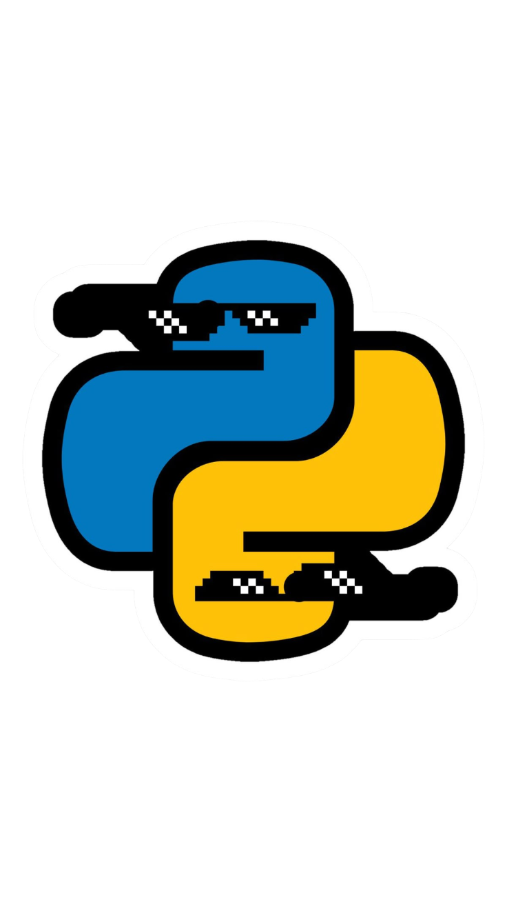

</img>

<!-- ================= TERMINAL + RIGHT IMAGE SECTION ================= -->

<table width="100%">
<tr>
<td width="55%" valign="top">

```bash
$ whoami
> Shubham-Shipt : Cybersecurity Enthusiast | Web Developer | Passionate about Cyber Systems

$ ./skills.sh --list-top
> C/C++ | Python | JavaScript | Social Engineering | Web Development

$ shubham --a
> OS: Kali Linux (amd64) | Alias: CyberOS

$ ps aux | grep active-projects
> ACTIVE: Cyber-Library | Portfolio | Python-Mini-Projects | Keylog-v6

$ cat /etc/address | grep contact
> Location: Noida | Email: your@email.com
```

</td>

<td width="45%" align="center" valign="top">


</td>
</tr>
</table>

<br/>

<!-- ================= USING TECH + USING TOOLS (SIDE BY SIDE WITH DIVIDER) ================= -->

<table width="100%">
<tr>
<td width="48%" valign="top">

<h2>🚀 Using Tech</h2>

<br/>

<p align="left">
  
  
  

</p>

</td>

<td width="4%" align="center" valign="top">


</td>

<td width="48%" valign="top">

<h2>🛠 Using Tools</h2>

<br/>

<p align="left">
  
  
  <br/><br/>
  
  
  <br/><br/>
  
  
</p>

</td>
</tr>
</table>

<br/><br/>

<!-- ================= PROFILE STATS BADGES ================= -->

# Profile Stats Badges

<br/>

<p align="center">

</p>

<br/><br/>

<!-- ================= PROJECTS SECTION ================= -->

# Projects

<hr/>

<table width="100%">
<tr>
<td height="180" align="center" width="20%"> </td>
<td height="180" align="center" width="20%"> </td>
<td height="180" align="center" width="20%"> </td>
<td height="180" align="center" width="20%"> </td>
<td height="180" align="center" width="20%"> </td>
</tr>
</table>

<br/><br/>

<!-- ================= FOLLOWERS DARK SECTION ================= -->

<div style="background-color:#0d1117;padding:20px;border-radius:6px;">

# ✨ Latest Followers

<br/>

<!-- FOLLOWERS_START -->

<!-- Dynamic follower grid will appear here exactly like your design -->

<!-- FOLLOWERS_END -->

</div>

